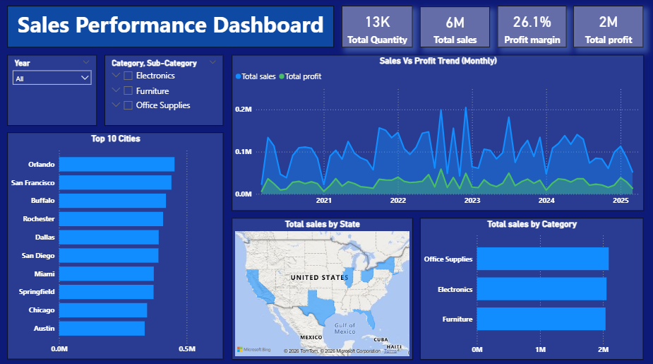

# Sales Performance Dashboard (Power BI)

## 📌 Project Objective
To analyze sales performance and identify trends, high-performing categories, cities, and regions using interactive Power BI visuals.

## 📂 Dataset Description
- Source: Public sales dataset
- Rows: 1194
- Columns: Order id, Amount, Profit, Quantity, Category, Sub-Category, Payment mode, Order date, Customer, State, City.
- Note: Currency is not specified; values are treated as numeric amounts.

## 🛠 Tools Used
- Power BI
- Microsoft Excel

## 📊 Dashboard Overview

## 🔍 Key Insights
- Sales show noticeable peaks during 2022–2023
- Electronics contributes the highest sales among categories
- Top 10 cities account for a significant portion of total sales
- Profit growth is lower than sales growth, indicating margin challenges

## 📁 Files
- Sales-Performance-Dashboard.pbix
- Dashboard.png

## 👤 Author
Abhay Singh
